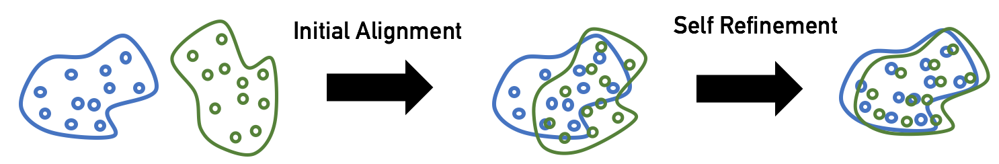

## Domain Adaptation for Cross Language API Learning 


## Dependencies
* Python 2/3 with [NumPy](http://www.numpy.org/)/[SciPy](https://www.scipy.org/)
* [PyTorch](http://pytorch.org/)
* [Faiss](https://github.com/facebookresearch/faiss) (recommended) for fast nearest neighbor search (CPU or GPU).

Available on CPU or GPU, in Python 2 or 3. Faiss is *optional* for GPU users - though Faiss-GPU will greatly speed up nearest neighbor search - and *highly recommended* for CPU users. Faiss can be installed using "conda install faiss-cpu -c pytorch" or "conda install faiss-gpu -c pytorch".

## Align monolingual word embeddings
This project includes two ways to obtain cross-lingual word embeddings:
* **Supervised**: using a train bilingual dictionary (or identical character strings as anchor points), learn a mapping from the source to the target space using (iterative) [Procrustes](https://en.wikipedia.org/wiki/Orthogonal_Procrustes_problem) alignment.
* **Unsupervised**: without any parallel data or anchor point, learn a mapping from the source to the target space using adversarial training and (iterative) Procrustes refinement.

For more details on these approaches, please check [here](https://arxiv.org/pdf/1710.04087.pdf).

### The supervised way: iterative Procrustes (CPU|GPU)
To learn a mapping between the source and the target space, simply run:
```bash
python supervised.py --src_lang en --tgt_lang es --src_emb data/wiki.en.vec --tgt_emb data/wiki.es.vec --n_refinement 5 --dico_train default
```
By default, *dico_train* will point to our ground-truth dictionaries (downloaded above); when set to "identical_char" it will use identical character strings between source and target languages to form a vocabulary. Logs and embeddings will be saved in the dumped/ directory.

### The unsupervised way: adversarial training and refinement (CPU|GPU)
To learn a mapping using adversarial training and iterative Procrustes refinement, run:
```bash
python unsupervised.py --src_lang en --tgt_lang es --src_emb data/wiki.en.vec --tgt_emb data/wiki.es.vec --n_refinement 5
```
By default, the validation metric is the mean cosine of word pairs from a synthetic dictionary built with CSLS (Cross-domain similarity local scaling). For some language pairs (e.g. En-Zh),
we recommend to center the embeddings using `--normalize_embeddings center`.

### Evaluate monolingual or cross-lingual embeddings (CPU|GPU)
We also include a simple script to evaluate the quality of monolingual or cross-lingual word embeddings on several tasks:

**Monolingual**
```bash
python evaluate.py --src_lang en --src_emb data/wiki.en.vec --max_vocab 200000
```

**Cross-lingual**
```bash
python evaluate.py --src_lang en --tgt_lang es --src_emb data/wiki.en-es.en.vec --tgt_emb data/wiki.en-es.es.vec --max_vocab 200000
```

