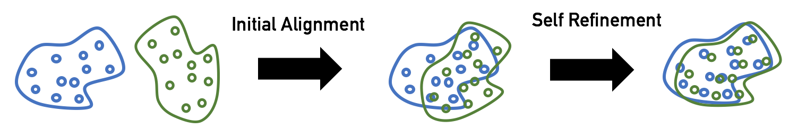

## Domain Adaptation for Cross Language API Learning 


## Dependencies
* Python 2/3 with [NumPy](http://www.numpy.org/)/[SciPy](https://www.scipy.org/)
* [PyTorch](http://pytorch.org/)
* [Faiss](https://github.com/facebookresearch/faiss) (recommended) for fast nearest neighbor search (CPU or GPU).

Available on CPU or GPU, in Python 2 or 3. Faiss is *optional* for GPU users - though Faiss-GPU will greatly speed up nearest neighbor search - and *highly recommended* for CPU users. Faiss can be installed using "conda install faiss-cpu -c pytorch" or "conda install faiss-gpu -c pytorch".

## Align monolingual word embeddings

* **Unsupervised**: without any parallel data or anchor point, learn a mapping from the source to the target space using adversarial training and (iterative) Procrustes refinement.

For more details on these approaches, please check [here](https://arxiv.org/pdf/1710.04087.pdf).

### The unsupervised way: adversarial training and refinement (CPU|GPU)
To learn a mapping using adversarial training and iterative Procrustes refinement, run:
```bash
python3 unsupervised.py --src_lang java --tgt_lang cs --src_emb data/java_vectors_sdk_functions_api_tokens_with_keywords_50_15.txt --tgt_emb data/cs_vectors_sdk_functions_api_tokens_with_keywords_50_15.txt --n_refinement 50 --emb_dim 50 --max_vocab 300000 --epoch_size 100000 --n_epochs 1
```
By default, the validation metric is the mean cosine of word pairs from a synthetic dictionary built with CSLS (Cross-domain similarity local scaling).

### Evaluate monolingual or cross-lingual embeddings (CPU|GPU)

**Cross-lingual**
```bash
python evaluate.py --src_lang en --tgt_lang es --src_emb data/wiki.en-es.en.vec --tgt_emb data/wiki.en-es.es.vec --max_vocab 200000
```

